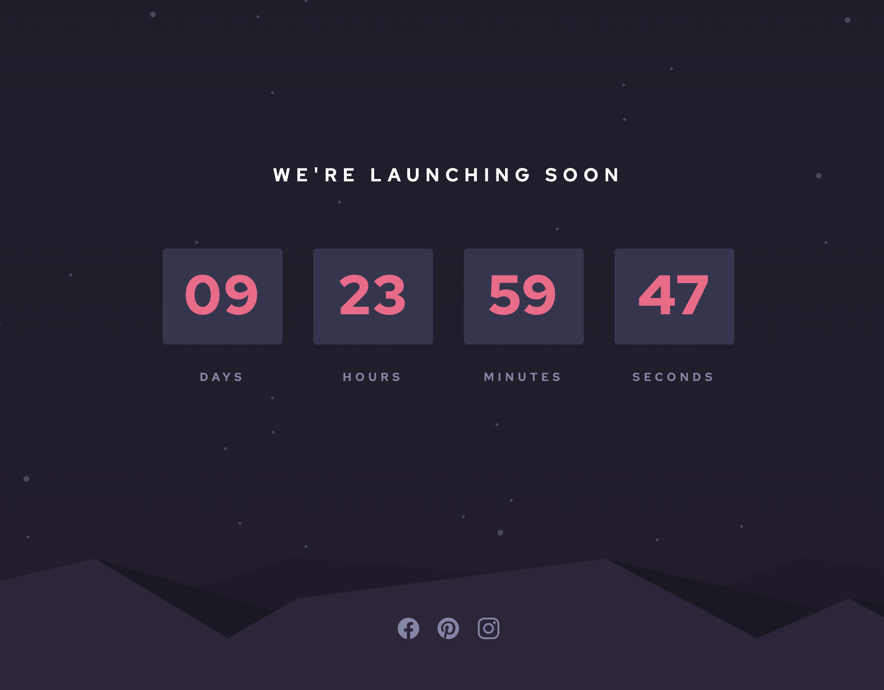
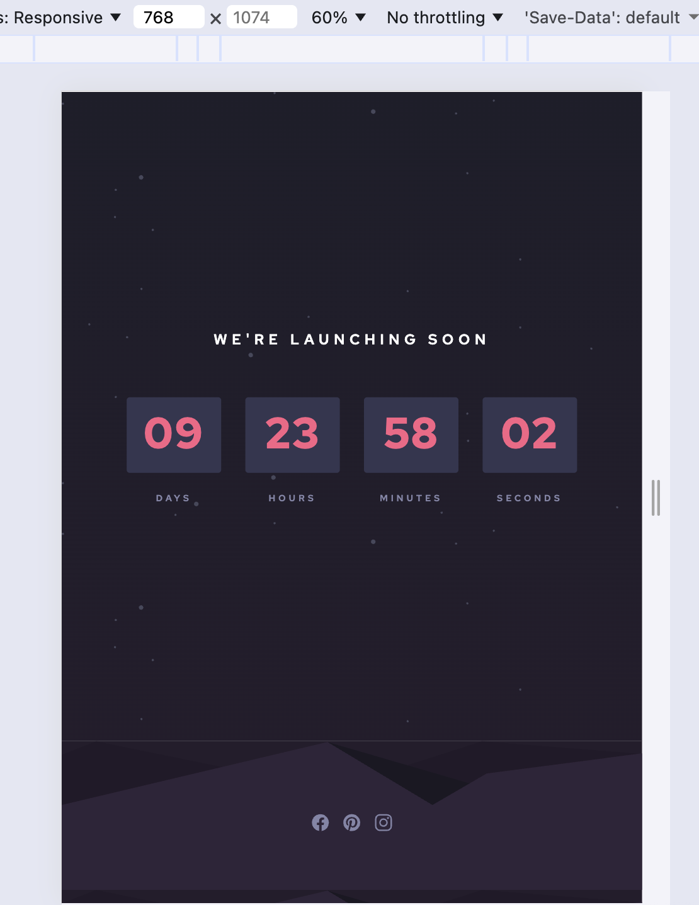
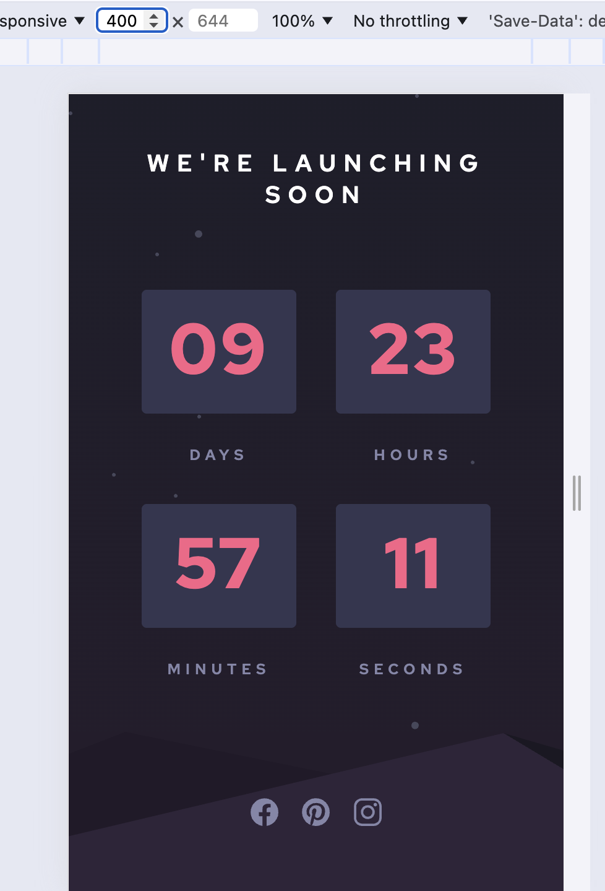

# 🚀 Countdown Timer – Responsive Frontend Challenge

A responsive countdown timer built using HTML, CSS, and JavaScript. This project displays the remaining time (days, hours, minutes, seconds) until a target date, with a clean UI and layered background design.

## Links

- Live Site: https://count-down-timer-ten-lac.vercel.app/
- Repository: https://github.com/uma-codespace/count-down-timer

## 📌 Features

⏳ Real-time countdown logic using JavaScript
📱 Fully responsive layout (desktop → mobile)
🎨 Custom UI with gradient + background image layering
🔢 Zero-padded time display (e.g., 04, 09)
🌄 Decorative backgrounds (stars + hills)
🧩 Modular and readable code structure
✨ Social media icons with hover effects (planned/added)

## 🛠️ Tech Stack

- HTML5 – Semantic structure
- CSS3 – Grid, Flexbox, responsive design
- JavaScript (ES6) – Time calculations & DOM updates
- Ionicons – Social media icons

## 🧠 How It Works

The countdown logic is based on the difference between the target timestamp and the current time:

- A future date is created using:

```js
const target = Date.now() + 10 _ 24 _ 60 _ 60 _ 1000;
```

- Every second (setInterval), the remaining time is calculated:
  - Days → total difference / milliseconds in a day
  - Hours → remainder % 24
  - Minutes → remainder % 60
  - Seconds → remainder % 60

- Values are formatted using:

```js
String(num).padStart(2, "0");
```

## 🎨 UI Highlights

- Layered Backgrounds

```css
background-image: url(images/bg-stars.svg), linear-gradient(#1e1e2a, #241d2c);
```

→ Stars appear on top of the gradient.

- Grid Layout
  - Main layout uses grid-template-rows
  - Timer uses grid-template-columns

- Flexbox
  - Used for centering content and icon alignment

## 📱 Responsive Design

- Desktop: 4-column timer layout
- Mobile: switches to 2-column grid
- Padding and spacing adjusted for smaller screens

## ✨ Upcoming / Enhancements

🔥 Icon hover animations (scale / color transitions)
🎯 Ability to set a custom target date
🌙 Dark/light theme toggle (optional enhancement)
⏹️ Stop timer when it reaches zero

## 📂 Folder Structure

```
project/
│
├── index.html
├── style.css
├── script.js
├── images/
│ ├── bg-stars.svg
│ └── pattern-hills.svg

```

## ▶️ Getting Started

- Clone the repository

`git clone <repo-url>`

- Open index.html in your browser

## 📸 Preview





## 💡 Learnings

- Time-based calculations in JavaScript
- Handling modular arithmetic for clocks
- Layering multiple backgrounds in CSS
- Building responsive layouts with Grid & Flexbox

## 🙌 Acknowledgment

- Challenge inspired by Frontend Mentor
